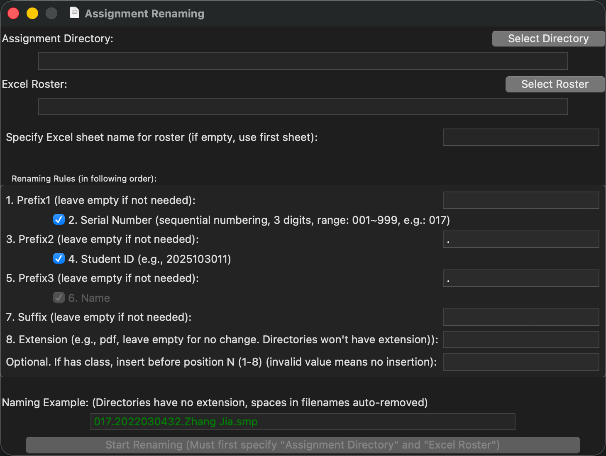

# RName - 作业批量重命名工具

[English](README.md) | **简体中文**

<div align="center">

**一个基于 Python 的学生作业批量重命名和统计工具**

[](https://www.python.org/downloads/)
[](LICENSE)
[](https://www.microsoft.com/windows)

</div>

---

## 📋 目录

- [简介](#-简介)
- [演示](#️-演示)
- [主要功能](#-主要功能)
- [安装依赖](#-安装依赖)
- [使用方法](#-使用方法)
- [重命名规则](#-重命名规则)
- [Excel 名单要求](#-excel-名单要求)
- [注意事项](#-注意事项)
- [更新日志](#-更新日志)
- [常见问题](#-常见问题)

---

## 📖 简介

RName 是一个专为教师设计的学生作业批量重命名工具，能够根据 Excel 名单自动规范化作业文件命名，并统计作业提交情况。

**作者**: Leo (geneleoc@gmail.com)  
**版本**: v1.3.12  
**更新日期**: 2023.03.24  
**创建日期**: 2021.12.28

---

## 🖼️ 演示

<div align="center">
  
  <p><i>RName 应用程序界面</i></p>
</div>

---

## ✨ 主要功能

### 核心功能

1. **批量重命名** - 对文件和文件夹进行标准化批量改名
   - 支持自定义命名格式（序号、学号、姓名、班级等）
   - 格式示例：`017.2022030432.张甲.22计科1班.docx`

2. **智能匹配** - 根据 Excel 名单智能匹配学生作业
   - 通过学生姓名进行主匹配（繁简体自动转换）
   - 同名学生通过学号精确区分
   - 自动识别境外生标记（`*`）和各类后缀

3. **重复检测** - 检测重复提交的作业并给出提示
   - 避免覆盖错误
   - 提供详细的重复作业列表

4. **统计功能** - 自动统计作业提交情况
   - 生成未交作业学生名单
   - 将提交情况自动写入 Excel（已交=1，未交=0）
   - 支持多次作业统计（交作业1、交作业2...）

### 特殊处理

- ✅ 繁体字自动转简体（使用 OpenCC）
- ✅ 识别并处理境外生标记（`*`）
- ✅ 自动去除常见后缀：`(线上)`、`(补修)`、`(重修)`、`(跟班重修)` 等
- ✅ 同名学生自动添加数字后缀：`张三1`、`张三2`
- ✅ 支持文件夹作为作业提交（无扩展名）

---

## 🛠 安装依赖

### 系统要求

- **操作系统**: Windows 10/11
- **Python**: 3.11 或更高版本
- **Microsoft Excel**: 必需（xlwings 依赖）

### 安装步骤

1. **安装 Python**
   
   从 [Python 官网](https://www.python.org/downloads/) 下载并安装最新版本

2. **安装依赖库**
   
   打开命令提示符（CMD）或 PowerShell，执行：
   
   ```bash
   pip install xlwings opencc -i https://mirrors.aliyun.com/pypi/simple/
   ```

   或使用官方源：
   
   ```bash
   pip install xlwings opencc
   ```

### 依赖说明

- **xlwings**: 用于读写 Excel 文件
- **opencc**: 用于繁简体中文转换

---

## 🚀 使用方法

### 图形界面操作

1. **运行程序**
   
   双击 `RName.py` 或在命令行执行：
   ```bash
   python RName.py
   ```

2. **指定作业目录**
   
   点击 "指定目录" 按钮，选择存放学生作业的文件夹

3. **指定 Excel 名单**
   
   点击 "指定名单" 按钮，选择包含学生信息的 Excel 文件

4. **设置重命名规则**（可选）
   
   - 勾选/取消需要的字段（序号、学号、姓名）
   - 设置前缀和后缀
   - 指定扩展名（留空表示保持原扩展名）
   - 班级插入位置（1-8，留空表示不包含班级）

5. **开始重命名**
   
   点击 "开始重命名" 按钮，程序将自动执行

### 命名示例

根据界面设置，生成的文件名格式如：

- `017.2022030432.张甲.docx`（序号 + 学号 + 姓名）
- `001.22计科1班.李四.pdf`（序号 + 班级 + 姓名）
- `张三.境外生.pptx`（仅姓名，境外生标记）

---

## 📐 重命名规则

重命名格式由以下字段按顺序组成（可选）：

| 序号 | 字段名 | 说明 | 示例 |
|------|--------|------|------|
| 1 | 前缀1 | 自定义前缀 | `-` |
| 2 | 序号 | 3位数字，范围001-999 | `017` |
| 3 | 前缀2 | 分隔符（默认为`.`） | `.` |
| 4 | 学号 | 从Excel读取 | `2022030432` |
| 5 | 前缀3 | 分隔符（默认为`.`） | `.` |
| 6 | 姓名 | 从Excel读取（必选） | `张甲` |
| 7 | 后缀 | 自定义后缀 | `.作业` |
| 附加 | 班级 | 可插入到位置1-8之前 | `22计科1班` |
| 8 | 扩展名 | 文件扩展名 | `.docx` |

**注意**: 
- 姓名字段为必选项（固定勾选）
- 文件夹作为作业提交时不添加扩展名
- 文件名中的空格会自动删除

---

## 📊 Excel 名单要求

### 表格格式

| 列号 | 列名 | 必需 | 说明 |
|------|------|------|------|
| A列 | 学号 | ✅ 必需 | 必须是数字格式，不能重复 |
| B列 | 姓名 | ✅ 必需 | 支持繁简体，可带`*`标记 |
| C列 | 班级 | ❌ 可选 | 需要时才读取 |
| D列起 | 交作业统计 | - | 程序自动写入 |

### 详细要求

1. **表单 (Sheet)**
   - 默认使用 Excel 文件的第一个表单
   - 可在界面中指定表单名称

2. **行要求**
   - 第1行为表头（标题行）
   - 数据从第2行开始读取到最后一行

3. **列要求**
   - 数据必须从第1列（A列）开始
   - 可包含2列（学号+姓名）或3列（学号+姓名+班级）

4. **数据写入**
   - 统计结果从第4列（D列）开始写入
   - 若D列已有数据，自动向后寻找空列
   - 列标题格式：`交作业1`、`交作业2`...
   - 数据格式：已交=`1`，未交=`0`

### Excel 示例

```
| 学号       | 姓名      | 班级        | 交作业1 | 交作业2 |
|------------|-----------|-------------|---------|---------|
| 2022030432 | 张三      | 22计科1班   | 1       | 1       |
| 2022030433 | 李四*     | 22计科1班   | 0       | 1       |
| 2022030434 | 王五(补修)| 22计科2班   | 1       | 0       |
```

---

## ⚠️ 注意事项

### 重要提示

1. **姓名匹配优先**
   
   程序根据文件名中的"姓名"进行匹配（学生很少会写错姓名），因此：
   - ✅ 文件名必须包含学生的正确姓名
   - ❌ 未包含或姓名错误的文件无法重命名

2. **同名学生处理**
   
   同名学生必须在文件名中包含正确的学号：
   - 班内有多个"张三"时，需通过学号区分
   - 文件名示例：`张三-2022030432-作业1.docx`

3. **文件层级限制**
   
   - ✅ 仅处理指定目录下的第一级文件/文件夹
   - ❌ 不会递归进入子目录（第二级目录）

4. **特殊字符处理**
   
   - ✅ 姓名前后的 `*` 会被识别为境外生标记
   - ✅ 自动去除后缀：`(线上)`、`(补修)`、`(重修)`、`(跟班重修)`、`(先修)`、`(辅修)` 等
   - ❌ 民族生标记 `△` 无法自动识别，需手动删除

5. **文件状态**
   
   - 确保待重命名的文件未被打开（尤其是 Word、Excel 等）
   - 确保 Excel 名单文件未被其他程序占用

6. **数据验证**
   
   - Excel 中学号必须为数字格式（可转换为整数）
   - 学号不能重复
   - 学号列和姓名列数据数量必须一致

---

## 📝 更新日志

### v1.3.12 - 2023.03.24

**环境**: Python 3.11.1, Windows 10/11

- 🐛 修复：学号数据类型验证，提前检查学号是否为数字
- 🐛 修复：无法处理"（线上）"等后缀的问题

### v1.3.11 - 2023.01.06

**环境**: Python 3.11.1, Windows 11

- ✨ 改进：Excel 列标题由"作业 n"改为"交作业 n"
- ✨ 改进：优化打印信息显示

### v1.3.10 - 2023.01.04

**环境**: Python 3.11.1, Windows 11

- 🐛 修复：注释导致的 `dupname` 字典未定义错误
- 🐛 修复：同名学生查找学号时的类型转换问题
- 🐛 修复：图标文件不存在时对话框显示问题

### v1.3.9 - 2022.12.26

**环境**: Python 3.10.4, Windows 10

- 🐛 修复：Excel 学号列非文本格式导致的字符串连接错误
- 🐛 修复：学号后带 `.0` 的问题（float 转 int 再转 str）
- ✨ 改进：支持处理多重括号后缀，如 `(跟班重修)(线上)`
- ✨ 改进：图标文件缺失时使用默认图标，不报错
- ✨ 改进：默认序号改为 3 位数
- ✨ 改进：默认改名时不包含班级

### v1.3.8 - 2022.06.03

### v1.3.7 - 2022.06.02

---

## ❓ 常见问题

### Q1: 运行时提示"缺少 xlwings 模块"？

**A**: 请确保已安装依赖库：
```bash
pip install xlwings opencc
```

### Q2: 提示"Excel 文件已打开"错误？

**A**: 关闭所有打开的 Excel 文件（包括名单文件），然后重试。

### Q3: 学号列读取错误？

**A**: 
- 确保学号列为数字格式（可转换为整数）
- 检查是否存在重复学号
- 学号不能包含文字或特殊字符

### Q4: 部分文件未被重命名？

**A**: 可能的原因：
- 文件名中不包含学生姓名
- 同名学生但文件名中学号错误或缺失
- 文件被其他程序占用

### Q5: 如何处理民族生标记 `△`？

**A**: 目前程序无法自动识别 `△` 标记，需要手动在 Excel 名单中删除该符号。

### Q6: 能否在 macOS 或 Linux 上运行？

**A**: 由于依赖 `xlwings` 库（需要 Microsoft Excel），目前仅支持 Windows 系统。

---

## 🔮 TODO

- [ ] 数据预检查：启动前验证姓名、学号、班级格式
- [ ] 改进错误处理：避免数据错误导致文件名丢失
- [ ] 支持更多特殊后缀识别（如 `△` 民族生标记）
- [ ] 添加日志功能：记录重命名历史
- [ ] 支持撤销操作：错误重命名可恢复
- [ ] 跨平台支持：考虑使用其他 Excel 处理库以支持 macOS 和 Linux

---

## 📄 许可证

本项目采用 MIT 许可证。详见 [LICENSE](LICENSE) 文件。

---

## 👤 作者

**Leo**

- Email: geneleoc@gmail.com
- 创建时间: 2021.12.28

---

## 🙏 致谢

感谢以下开源项目：

- [xlwings](https://www.xlwings.org/) - Python Excel 自动化库
- [OpenCC](https://github.com/BYVoid/OpenCC) - 中文繁简转换工具

---

<div align="center">

**如果这个工具对你有帮助，欢迎 Star ⭐**

</div>
